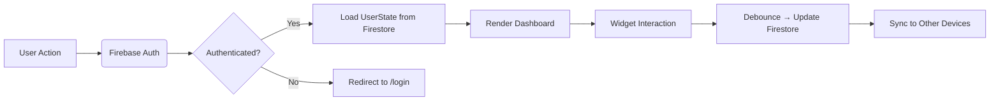

# OPEN-SPEC — DevTools v1.0  
*An engineering contract for implementation. All contributors and AI agents must adhere strictly to this spec.*

---

## 1. System Overview

### 1.1 Purpose  
A mobile-first, personalized web dashboard that unifies discovery, organization, and execution of development tools — enhanced with context-aware suggestions and embeddable widgets.

### 1.2 Target Users  
- Software engineers (frontend, backend, full-stack)  
- DevOps/SRE engineers  
- UX/UI designers  
- System architects & technical leads  
- Engineering students  

### 1.3 Core Value Proposition  
- Reduce cognitive load from context-switching.  
- Surface the *right tool* at the *right time*.  
- Enable persistent, lightweight utilities directly in the workspace.  
- Sync user state seamlessly across devices.

### 1.4 Scope (V1)  
✅ Authenticated user dashboard  
✅ Tool catalog (static JSON)  
✅ Smart contextual worksets (client-side heuristics)  
✅ DevToolbox: draggable, state-synced widgets  
✅ Mobile-first responsive UI  
❌ No server-side tool execution  
❌ No team/org features  
❌ No CLI or desktop app

---

## 2. Functional Requirements

### 2.1 User Authentication
- Users can sign in via **Email/Password** or **Google** (Firebase Auth).  
- Anonymous mode is **not supported** — all features require authentication.  
- On first login, a `UserState` document is created in Firestore.

### 2.2 Dashboard
- Displays:  
  - 4 statistics cards (`Total Tools`, `Favorites`, `Recent`, `Categories`)  
  - *If active*: **Suggested Workset Banner** (see 2.4)  
  - Sections: `Favorite Tools`, `Recent Tools`, `Your Worksets`  
- All sections are scrollable horizontally on mobile, grid on desktop.

### 2.3 Tool Discovery & Detail
- `/tools` page: searchable/filterable list of all tools (by name, tag, category).  
- `/tools/[id]` page:  
  - Shows full metadata, preview (iframe/image/local), launch button.  
  - Includes “Quick Actions”:  
    - `Open in New Tab`  
    - `Copy Link`  
    - `Add to Workset` → opens modal to select/create workset.

### 2.4 Smart Contextual Worksets
- **Trigger Heuristics (client-side only)**:  
  | Trigger | Detection Rule |
  |--------|----------------|
  | `github-pr` | `window.location.href.includes('github.com') && /\\/pull\\/\\d+/.test(url)` |
  | `json` | Clipboard contains `{` and `}` with balanced braces (simple heuristic) |
  | `color` | Clipboard matches `/^#[0-9a-fA-F]{3,6}$/` or `/^rgb\\(/` |
  | `timestamp` | Clipboard is 10–13 digit number (Unix epoch) |
- On trigger:  
  1. Generate ephemeral workset (max 3 tools matching `supportsContext`).  
  2. Store in `userState.suggestedWorksets` with `expiresAt = now + 24h`.  
  3. Display banner on dashboard.  
- User can `Dismiss` → sets `dismissedAt`, hides until next trigger.

### 2.5 DevToolbox
- Toggle via `🧰 Toolbox` button (top-right on desktop, in drawer on mobile).  
- Panel uses `react-grid-layout`:  
  - Each widget: `{ i: string, x, y, w, h, toolId, state }`  
  - Min size: `w=2, h=2` (grid units)  
  - Max widgets: 8 (to prevent performance issues)  
- Widget actions:  
  - `➕ Add Widget`: modal listing tools where `isWidget: true`  
  - `➖ Close`: removes from layout  
  - `↗ Pop Out`: navigates to `/tools/[id]`  
- Widget state (e.g., input text) debounced-syncs to Firestore every 2s.

### 2.6 Workset Management
- Users can:  
  - Create, rename, delete worksets  
  - Add/remove tools to/from worksets  
- Stored in `userState.worksets` (Firestore).

### 2.7 Favorites & Recent Tracking
- Clicking `Launch Tool` or `Open` → adds to `recentlyUsed` (max 10, FIFO).  
- `Add to Favorites` toggles tool ID in `userState.favorites`.

---

## 3. Non-Functional Requirements

### 3.1 Performance
- Dashboard TTI (Time to Interactive) ≤ 1.5s on 3G (Lighthouse).  
- Widgets are code-split: `dynamic(() => import('../widgets/JsonFormatterWidget'))`.  
- Tool catalog served as static JSON (`/public/data/tools.json`).

### 3.2 Security
- Firebase Security Rules:  
  ```firestore
  match /users/{userId} {
    allow read, write: if request.auth != null && request.auth.uid == userId;
  }
  ```
- No client-side secrets.  
- Clipboard access is **opt-in**: first use shows modal:  
  > “Enable smart suggestions? DevTools will check clipboard *only in this tab*.”  
  → Sets `userState.customization.clipboardMonitoring = true`.

### 3.3 Accessibility (WCAG 2.1 AA)
- All interactive elements keyboard-navigable.  
- Widget headers have `role=\"region\"` and `aria-label`.  
- Color contrast ≥ 4.5:1 for text.  
- Reduced motion support (`prefers-reduced-motion`).

### 3.4 Maintainability
- **Naming Conventions**:  
  - Files: `PascalCase` for components (`JsonFormatterWidget.tsx`), `kebab-case` for pages (`tool-detail.tsx`).  
  - Variables: `camelCase` (`userState`, `toolId`).  
  - Constants: `UPPER_SNAKE_CASE` (`MAX_WIDGETS = 8`).  
  - Firestore collections: `snake_case` (`user_state`).  
- **Coding Standards**:  
  - TypeScript strict mode enabled.  
  - ESLint + Prettier (config in repo).  
  - No `any`; use explicit interfaces.

### 3.5 Internationalization
- Not in V1, but:  
  - All UI strings wrapped in `t('key')` placeholder (e.g., `t('dashboard.title')`).  
  - No hardcoded English in components.

---

## 4. System Architecture

### 4.1 Frontend
- **Framework**: Next.js 14 (App Router)  
- **Routing**:  
  - `/` → `app/page.tsx` (Dashboard)  
  - `/tools` → `app/tools/page.tsx` (Catalog)  
  - `/tools/[id]` → `app/tools/[id]/page.tsx` (Detail)  
- **State Management**:  
  - Global: `UserContext` (React Context + `useReducer`) for `userState`.  
  - Local: `useState`/`useReducer` per widget.  
- **Data Fetching**:  
  - Tools: `fetch('/data/tools.json')` on app load.  
  - User state: `onAuthStateChanged` → `getDoc(users/${uid})` → sync to context.

### 4.2 Backend
- **None** (V1 is client-side + Firebase).  
- Firebase services:  
  - Auth: user management  
  - Firestore: `users` collection  
  - Storage: `/previews/{toolId}.webp` (for future)

### 4.3 Data Flow


---
_Last updated: November 27, 2025_  
_Spec version: 1.0_  
_Author: benneberg_
